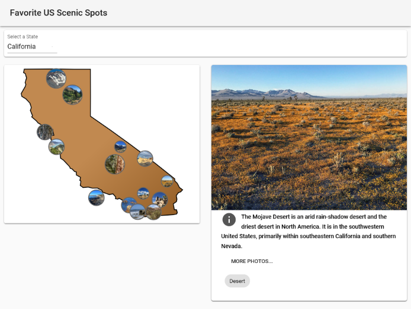
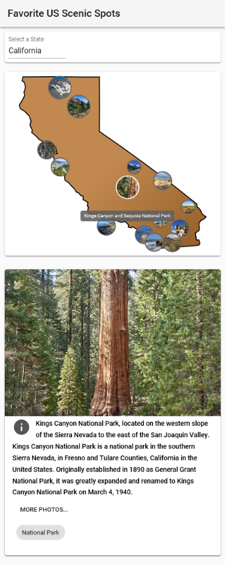

View photos by state. 

Written using Material UI Bootstrap, React, Javascript. More states to come soon.

How it works: Each state is rendered in SVG with each photo mapped from latitude and longitude coordinates to local, virtual coordinates.

